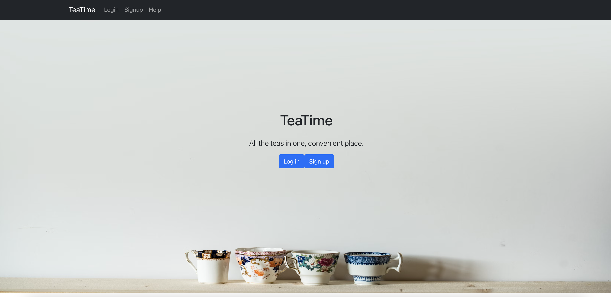
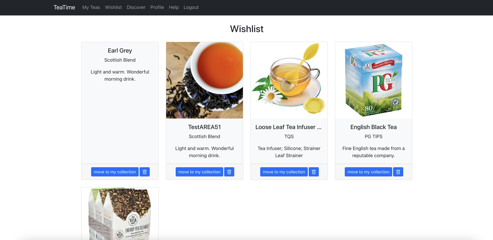
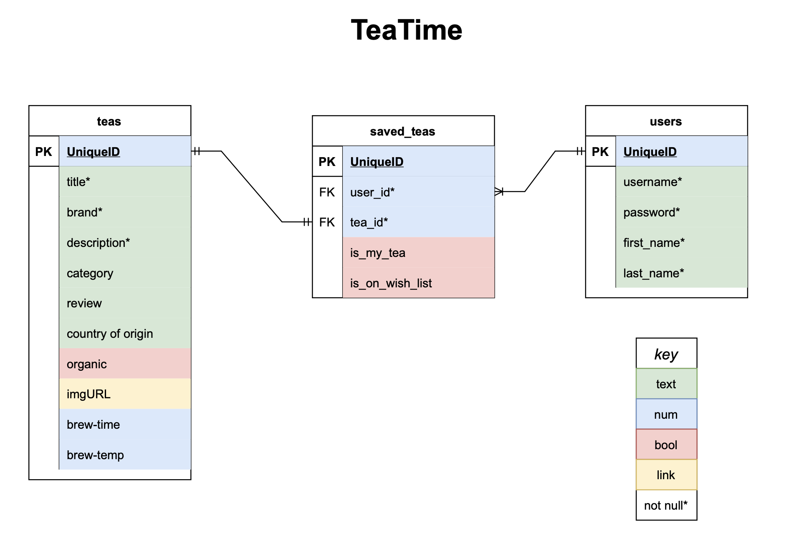

<!-- @format -->

# TeaTime

Introducing the tea app you've long been waiting for...

[OPEN APPLICATION](https://tea-time.surge.sh)

---

## What is TeaTime?

### TO THE USER

- the nexus for all your tea adventures.
- create your own personal account
- keep track of your teas
- browse a huge database and discover new teas
- construct your very own wishlist
- etc...

### TO THE TECHIE

- TeaTime is a fully functional and tested application consisting of a backend and frontend.
- **Backend**: Express/Node.js
- **Frontend**: React & Bootstrap
- **Database**: PostgreSQL database in the cloud (Heroku)
- **API**:
  - Internal calls: to the Express backend, with full CRUD capabilities.
  - External calls: to the external API, [Spoonacular](https://spoonacular.com/food-api).
- **Deployment**:
  - Backend - Heroku
  - Frontend - Surge

---

## Images

---

## Database Schema

---

## TeaTime Backend

- Deployed to an entirely separate Github repo
- [LINK to Repo](https://github.com/alexanderaboutanos/TeaTime-backend)
- [LINK to Backend URL](https://teatime-backend.herokuapp.com/)

---

## Testing

- **Testing Framework:** [Jest](https://jestjs.io/)
- backend: in the terminal, type: `jest`
- frontend: in the terminal, type: `npm test`

- **Includes**:
  - smoke tests
  - snapshot tests
  - integration tests
  - unit tests
  - end to end tests

---

## About the Developer

- My name is Alexander, and I'm just your friendly neighborhood developer.

- Contact me:
  - **EMAIL:** alexanderaboutanos@gmail.com
  - **LinkedIn**: [Alexander Aboutanos](https://www.linkedin.com/in/alexander-aboutanos/)
- ***

## HOW TO USE THIS APPLICATION:

### Getting Started

- When first entering the TeaTime application, you have two options: Signup and Login

- Login - If you already have an account, select login and enter your username and password.
- Signup - If you do not have an account... select signup button. Now, enter your details.

- "Will my password be safe?" - Yes. TeaTime will take your password and encrypt it, never exposing it to sneaky cyber attacks.

- Local Storage - Did your cat accidentaly close your browser window? It would be a nuisance to have to enter your login details again. Fear not, your account details will be stored on local storage so you only need to access the site again and you will be automatically logged in.
- Profile - If you ever want to revist your account details, simply click the profile button on the navigation bar at the top of your page.
- Data - all of your tea data will be stored on an external database and will not be lost when you refresh the page, or access the website from a friend's house. That being said, we promise not to sell your data (unless someone offers a great price).

---

### Track Your Teas

- One of the amazing features of TeaTime is the ability to track all the teas that you currently own.
- Click on the My Teas tab, to access the page.

- Add Tea - The button labeled 'Add New Tea' allows you to manually enter details of the tea that you own.
- Add to Wishlist - Each tea can be removed from the My Teas list and added to the Wishlist by simply clicking on the "move to wishlist" button.
- Delete Tea - Conversely, you may delete any tea on this page, by simply pressing the button.
- Tea Details - Want more details on a particular tea? Just click on it. You will be sent to a page built just for that tea.
- Edit Tea - Once you are on a Tea detail page, you can edit the information.

---

### Finding New Teas

- TeaTime gives users the option to discover new teas by searching a huge database. You can even add teas to your Wishlist or MyTeas.
- Click on the Discover tab, to access the page.

- Search - You are greeted by a large search bar. Simply type in any tea you are interested in, and click the blue search button.
- Spoonacular - With some help from our friends over at Spoonacular, you can look through their massive database of teas.
- Add to Wishlist - Found a tea that you are interested in? Click to add it to your wishlist.
- Add to My Teas - Do you already own this tea? Add it to My Tea list directly by pressing the button.

---

### WishList

- With TeaTime, you can store teas you hope to one day own!
- Click on the Wishlist tab, to access the page.

- Add to My Teas - Once you purchase the tea, simply click the button to switch it over to your My Teas list.
- Delete Tea - Not interested in this tea anymore? You may delete any tea on this page, by simply pressing the button.

---

Enjoy your tea and brew on!
